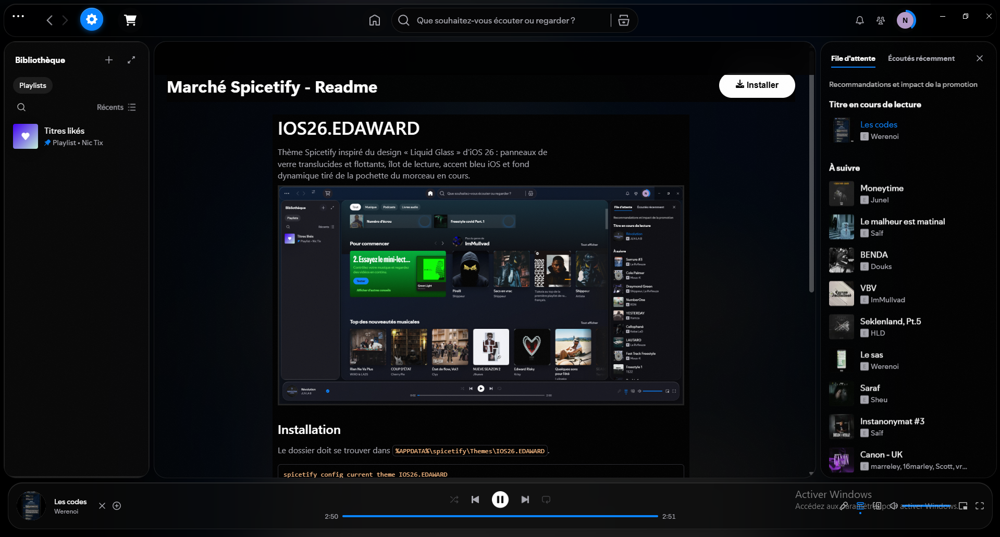

# IOS26.EDAWARD

Thème Spicetify inspiré du design « Liquid Glass » d'iOS 26 : panneaux de
verre translucides et flottants, îlot de lecture, fond dynamique tiré de la
pochette du morceau en cours et panneau de réglages intégré.



## Installation

Le dossier doit se trouver dans `%APPDATA%\spicetify\Themes\IOS26.EDAWARD`.

```
spicetify config current_theme IOS26.EDAWARD
spicetify config color_scheme dark
spicetify apply
```

## Menu de configuration

Clique sur le bouton **IOS26** (icône réglages, près des flèches de
navigation en haut) pour ouvrir le panneau :

- **Schéma** : Sombre / Clair / Auto (suit Windows) / AMOLED (noir pur,
  pensé pour les écrans OLED) — bascule instantanée avec fondu, sans
  `spicetify apply`
- **Accent** : 9 couleurs système iOS (rouge, orange, jaune, vert,
  sarcelle, bleu, indigo, violet, rose)
- **Fond pochette** : active/désactive le fond dynamique tiré de la
  pochette ; son assombrissement s'adapte automatiquement à la
  luminosité de chaque pochette pour garder le texte lisible
- **Flou** : Désactivé / Subtil / Normal / Fort — « Désactivé » supprime
  tous les effets de verre coûteux (recommandé sur les machines modestes)

Les réglages sont mémorisés entre les sessions.

## Compatibilité

- Spicetify 2.44.0 (version testée), Windows 11
- Mac/Linux : non testés — le thème n'utilise que des API Spicetify
  standard, les retours sont bienvenus

## Schémas (via CLI, optionnel)

- `dark` — verre fumé (défaut)
- `light` — verre givré : `spicetify config color_scheme light && spicetify apply`
- `amoled` — noir pur : `spicetify config color_scheme amoled && spicetify apply`

## Troubleshooting

- **Le thème ne s'applique pas** : vérifier `spicetify config current_theme`
  (doit valoir `IOS26.EDAWARD`), puis relancer `spicetify apply`.
- **Après une mise à jour de Spotify** : Spotify écrase les
  modifications ; relancer `spicetify backup apply`.
- **Le panneau IOS26 n'apparaît pas** : le bouton se charge une fois
  Spotify prêt (2-3 s). Vérifier que `extensions` n'a pas été vidé et que
  `theme.js` est bien présent dans le dossier du thème.
- **Couleurs incohérentes avec une extension** : les extensions qui
  remappent les variables `--spice-*` peuvent entrer en conflit ; tester
  en les désactivant une à une.

## Fichiers

- `color.ini` — palettes (dark / light / amoled)
- `user.css` — matériau verre, disposition flottante, composants
- `theme.js` — fond dynamique, panneau de réglages, overlay adaptatif
