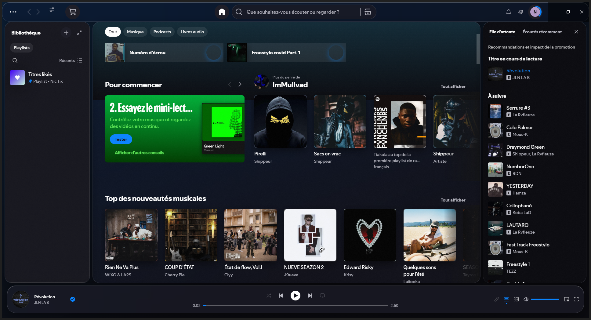

# IOS26.EDAWARD

Thème Spicetify inspiré du design « Liquid Glass » d'iOS 26 : panneaux de
verre translucides et flottants, îlot de lecture, accent bleu iOS et fond
dynamique tiré de la pochette du morceau en cours.



## Installation

Le dossier doit se trouver dans `%APPDATA%\spicetify\Themes\IOS26.EDAWARD`.

```
spicetify config current_theme IOS26.EDAWARD
spicetify config color_scheme dark
spicetify apply
```

## Menu de configuration

Clique sur le bouton **IOS26** (icône réglages, près des flèches de
navigation en haut) pour ouvrir le panneau :

- **Schéma** : Sombre / Clair / Auto (suit Windows) — bascule instantanée,
  sans `spicetify apply`
- **Fond pochette** : active/désactive le fond dynamique tiré de la pochette
- **Flou** : subtil / normal / fort — intensité du verre

Les réglages sont mémorisés entre les sessions.

## Schémas (via CLI, optionnel)

- `dark` — verre fumé (défaut)
- `light` — verre givré : `spicetify config color_scheme light && spicetify apply`

## Fichiers

- `color.ini` — palettes
- `user.css` — matériau verre, disposition flottante, composants
- `theme.js` — fond dynamique (pochette floutée)
